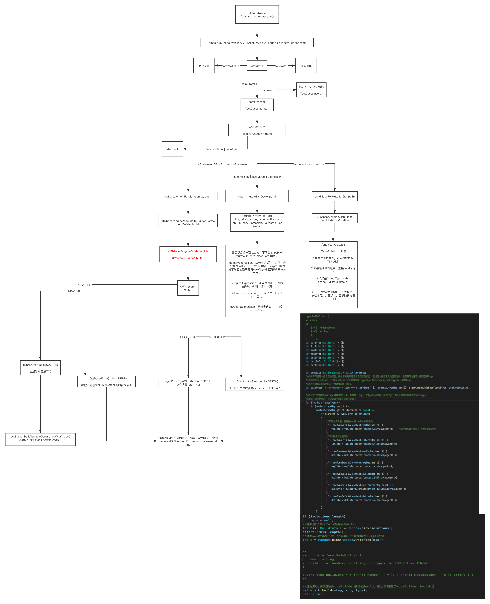

# DIE源码分析

[TOC]


## 论文

主要关注论文中 *V. IMPLEMENTATION* 的部分。

大体上，DIE被实现为一个AFL变体，也可以在分布式环境中运行。

首先，**DIE在AFL中引入了一个预处理阶段**。从现有的测试套件和PoC开始，DIE利用其类型分析器来构建它们的类型化AST，并将它们与源文件一起保存到输入语料库。

更重要的是，**DIE用自己的变异引擎取代了AFL的二进制输入的变异器**。

突变引擎使用类型化AST构建器来构建随机子AST，用于突变或增长从语料库中选择的类型化AST。DIE重用了AFL的大部分其他组件，包括叉子服务器、种子调度器和覆盖率收集器。

然而，**DIE禁用了原始AFL中的修剪阶段**，它从种子输入中破坏了各个方面。请注意，DIE大量使用了Babel[28]，一个流行的JavaScript转译器，来完成JavaScript文件AST层面上的所有任务。为了支持DIE以分布式方式运行，我们实现了几个harnesses。

(1)一个集中的协调器，在不同机器上运行的DIE实例之间同步发现测试用例，并收集崩溃情况；
(2)一个本地代理，管理DIE在一台机器上的执行；
(3)crash reporter，重复发现crash情况并报告给协调器coordinator。

## 源码结构

```shell
.
├── README.md
├── compile.sh
├── engines
│   ├── README.md
│   ├── build-ch-cov.sh
│   ├── build-ch.sh
│   ├── build-jsc-cov.sh
│   ├── build-jsc.sh
│   ├── build-sm-cov.sh
│   ├── build-sm.sh
│   ├── build-v8-cov.sh
│   ├── build-v8.sh
│   ├── compiler
│   │   ├── clang -> proxy.py
│   │   ├── clang++ -> proxy.py
│   │   └── proxy.py
│   ├── download-engine.sh
│   └── utils
├── fuzz
│   ├── TS
│   │   ├── base
│   │   │   ├── const
│   │   │   │   ├── number.ts
│   │   │   │   ├── regexp.ts
│   │   │   │   └── string.ts
│   │   │   ├── engine
│   │   │   │   ├── ast.ts			//*****//新生成的对象最终在这里被build成新的TSNode node并返回
│   │   │   │   ├── builtin.ts
│   │   │   │   ├── context.ts
│   │   │   │   ├── esbuild.ts
│   │   │   │   ├── exp.ts			//*****//真正的样本变异的具体实现。
│   │   │   │   ├── function.ts
│   │   │   │   ├── literal.ts
│   │   │   │   ├── statement.ts	//****//真正生成变异后的新的statement对象的位置
│   │   │   │   ├── type.ts
│   │   │   │   └── var.ts
│   │   │   ├── esgenerator.ts
│   │   │   ├── esinfer.ts
│   │   │   ├── esmutator.ts		  //*****//具体实现了变异阶段mutate函数
│   │   │   ├── esparse.ts
│   │   │   ├── espreference.ts
│   │   │   ├── esspecs.ts
│   │   │   ├── estestcase.ts			//*****//这里维护了TestCase，变异函数从这里调用
│   │   │   ├── estypes.ts
│   │   │   ├── esverifier.ts
│   │   │   ├── esweight.ts
│   │   │   └── utils.ts					//*****//实现并重写了一些函数，比如Random，weighted
│   │   ├── config.ts							//进行一些配置
│   │   ├── esfuzz.ts							//*****// afl-fuzz.c最后会执行这个文件，这个是main entry，由他调用了其他的
│   │   ├── package.json
│   │   ├── redis_ctrl.ts
│   │   ├── tsconfig.json
│   │   └── typer
│   │       ├── jslib
│   │       │   ├── chakra.js
│   │       │   ├── ffx.js
│   │       │   ├── jsc.js
│   │       │   └── v8.js
│   │       ├── resolve.py
│   │       ├── typer.py
│   │       └── typer.ts
│   ├── afl
│   │   ├── Makefile
│   │   ├── QuickStartGuide.txt -> docs/QuickStartGuide.txt
│   │   ├── README -> docs/README
│   │   ├── README-JS.md
│   │   ├── afl-analyze.c
│   │   ├── afl-as.c
│   │   ├── afl-as.h
│   │   ├── afl-fuzz.c				//****//可以从这里出发开始看主要是main调用的fuzz_js函数
│   │   ├── afl-gcc.c
│   │   ├── afl-gotcpu.c
│   │   ├── afl-showmap.c
│   │   ├── afl-tmin.c
│   │   ├── alloc-inl.h
│   │   ├── config.h
│   │   ├── debug.h
│   │   ├── dictionaries
│   │   ├── docs
│   │   │   └── vuln_samples
│   │   ├── experimental
│   │   ├── hash.h
│   │   ├── init
│   │   │   ├── ch.sh
│   │   │   └── jsc.sh
│   │   ├── libdislocator
│   │   ├── libtokencap
│   │   ├── llvm_mode
│   │   ├── qemu_mode
│   │   ├── run
│   │   │   ├── ch.sh
│   │   │   └── jsc.sh
│   │   ├── test-instr.c
│   │   └── types.h
│   └── scripts
│       ├── kill.sh
│       ├── make_initial_corpus.py
│       ├── populate.sh
│       ├── prepare.sh
│       ├── redis.py
│       ├── run-all.py
│       └── run.sh
└── tree

34 directories, 208 files

```

## redies_control

redies控制部分的核心文件是：```TS/base/redis_ctl.ts``` ，用来获取testcase，crash repo等。主要通过nodejs方式执行。起redis server就是用来做redis控制。监控整个fuzz的情况。

### redis_ctrl.js（TS/base/）

#### getNextTestcase

我们注意到在afl-fuzz中使用了：

```shell
node own_loc/../TS/redis_ctrl.js getNextTestcase cur_input
```

来获取Testcase。

我们主要看这个函数，我没开发过nodejs，呜呜呜，这个jsFile应该是我们传入的cur_input。

```typescript
function getNextTestcase(jsFile: string) {
    const typeFile = jsFile + ".t";	//生成.t结尾的typefile
  
  	//首先调用本文件内的createRedisClient函数来创建client
  	//redis.createClient(process.env.REDIS_URL);而REDIS_URL 在/fuzz/script中配置成environ["REDIS_URL"] = "redis://localhost:9000"
    const client = createRedisClient();

    async.waterfall(
        [ (next: any) => {
          //弹出newPathsQueue中最后一个元素，添加到oldPathsQueue
            client.rpoplpush("newPathsQueue", "oldPathsQueue",
                (err: any, res: string) => {
                    if (err) {
                        return next(err, res);
                    }

                    if (res) {
                      //如果成功
                      //json解析res
                      //把返回的json中的js文件写入cur_input(jsFile)
                      //把返回的json中的type写入typeFile
                        const fileObj = JSON.parse(res);
                        fs.writeFileSync(jsFile, fileObj.js);
                        fs.writeFileSync(typeFile, fileObj.type);
                        next(true); // Early finish
                    } else {
                        next(err);
                    }
                },
            );
        },
        (next: any) => {
            client.rpoplpush("oldPathsQueue", "oldPathsQueue",
                (err: any, res: string) => {
                    if (err) {
                        return next(err, res);
                    }

                    if (res) {
                        const fileObj = JSON.parse(res);
                        fs.writeFileSync(jsFile, fileObj.js);
                        fs.writeFileSync(typeFile, fileObj.type);
                    } else {
                        console.log("[-] getNextTestcase - Need to populate first");
                    }
                    next(err);
                });
        }],
        (err: any) => { client.quit(); },
    );
}
```

#### reportStatus

在afl-fuzz.c中的 ```write_stats_file``` 函数执行了：

```shell
node own_loc/../TS/redis_ctrl.js reportStatus 
```

来报告崩溃结果。

```typescript
function reportStatus(fuzzerId: string, fuzzerStats: string) {
  const client = createRedisClient();
  const stats = fs.readFileSync(fuzzerStats).toString();

  async.waterfall([
      (callback: any) => {
        client.sadd("fuzzers", fuzzerId,
            (err: any, res: any) => { callback(err, res); });
      },
      (_: any, callback: any) => {
        client.set("fuzzers:" + fuzzerId, stats,
            (err, res) => { callback(err, res); });
      }],
      (err, res) => { client.quit(); });
}
```

#### others

## 变异阶段源码分析

大概流程：



### alf-fuzz.c

主要用``` skipped_fuzz = fuzz_js(use_argv);``` 来fuzz。

1.首先获取fuzz_inputs_dir。

```fuzz_inputs_dir = alloc_printf("%s/fuzz_inputs", out_dir);```


2.获得当前的输入：```cur_input = alloc_printf("%s/.cur_input.js", out_dir);```


3.获取testcase。实际就是执行nodejs：

```shell
node own_loc/../TS/redis_ctrl.js getNextTestcase cur_input #cur_input在上一步产生
```


4.产生js样本

```c
fuzz_status = generate_js(cur_input, fuzz_inputs_dir);
```

在generate_js中主要执行了：

```shell
timeout 30 node own_loc/../TS/esfuzz.js cur_input fuzz_inputs_dir cnt seed
```

seed是一个生成的UINT32_MAX范围内的整数。cnt应该是次数。最后输出一个产生样本所花费的时间gen_time。

这里负责将cur_input中的文件进行变异后放到fuzz_inputs_dir以备使用。


5.然后调用 ``nl_cnt = fuzz_dir(fuzz_inputs_dir, argv);`` 使用fuzz_inputs_dir目录下的样本。fuzz完输出一个fuzz所用时间。


6.在```fuzz_dir``` 中用for循环扫描目录下的文件。

- 首先取到目录下的文件，然后进行筛选，然后将合适的单个文件，mmap映射文件内容到内存，rw权限。返回映射的位置 mem。
- 调用 ```common_fuzz_stuff(argv, mem, len)``` 进行执行对应的程序。结束后计算时间，解映射。

### esfuzz.ts

1.首先new了三个对象：

```typescript
    let code : Code = new Code(fpath);
    let tast : TypedAST = code.parse();
    let tc = new TestCase(code, tast);
```

首先利用输入文件生成一个Code对象（定义在 ```estestcase.ts``` 中），然后对此code对象调用 成员函数```parse()``` 抽出AST。返回一个TypedAST类型（定义在```esparse.js``` 中）的tast。

接下来new一个TestCase对象（定义在 ```estestcase.ts``` 中）对象中的code和tast成员就是我们上一步构建好的。这个tc在本文件的后面多次使用。

2.对构建好的TestCase实例对象tc进行变异配置（mutate config）。

```typescript
tc.config(4, 8, 2, 1);
......
public config(mMin: number, mMax: number, iLocMax: number, iNumMax: number) {
        this.MUTATE_MIN = mMin;
        this.MUTATE_MAX = mMax;
        this.INSERT_LOC_MAX = iLocMax;
        this.INSERT_NUM_MAX = iNumMax;
    }
```

3.进行builder配置。其中builder被定义在 ```engine/esbuild.ts```

```typescript
builder.config(2, 2);
......
public config(depth: number, size: number): void {
        this.DEPTH = depth;
        this.FUNC_SIZE = size;
    }
```

4.用for循环调用变异函数来做mutate。

```typescript
    for (let i = 0; i < cnt; i++) {

        // for each test case, we reset the var cnt
        builder.setVarCnt(tast.maxVarCnt);
        let _fpath: string = dpath + "/" + i + ".js";
        switch(Random.number(3)) {
            case 0:
            case 1:
                tc.mutate();												//进行变异
                tc.writeToFile(_fpath, seed, true);	//写出文件，seed用来做标识
                tc.revert();												//还原操作，似乎还原一些不合法的操作数之类的，这个没细看。												
                break;
            case 2:
                tc.insert();
                tc.writeToFile(_fpath, seed, true);
                tc.revert();
                break;
        }

   }
```

这里打一个随机数来选择变异？

### estestcase.ts

#### TestCase

```typescript
export class TestCase
{
    tast: TypedAST;
    root: TSNode;
    code: Code;

    undefineds: Array<TSNode>;

    paths: Map<TSNode, NodePath>;

    // These are the nodes that we may mutate.
    nodes: Map<TSNode, number>;
    
    // These are the nodes that we temporarily 
    // remove because of mutation.
    removed: Array<Pair<NodePath, TSNode>>;
  
    // These are the nodes that we change 
    // their operand.
    opchanged: Array<Pair<NodePath, string>>;

    // We store (parentPath, bodyPaths) in a pair 
    // for insertion.
    bodies: Array<Pair<NodePath, Array<NodePath>>>;

    // We insert |second| number of statements after the |first|th 
    // statement. 
    // If |first| is -1, it means we insert the statements
    // at the beginning of the body.
    added: Map<number, Map<number, number>>;

    // current NodesMap：用来做当前的轮变异
    curNodesMap: Map<TSNode, number>;

    MUTATE_MIN: number;
    MUTATE_MAX: number;

    INSERT_LOC_MAX: number;
    INSERT_NUM_MAX: number;

    constructor(code: Code, tast: TypedAST) {
        this.tast = tast;
        this.root = tast.root;
        this.code = code;
        this.paths = new Map<TSNode, NodePath>();
        this.nodes = new Map<TSNode, number>();
        this.undefineds = [];
        this.removed = [];
        this.opchanged = [];

        this.bodies = [];
        this.added = new Map();

        if (!this.code.raw) {
            this.preVisit(); 
        }
    }
  ......
public mutate(): void {
  												//this.nodes = new Map<TSNode, number>()
        this.curNodesMap = new Map(this.nodes); // make a copy of the weighted node map

        let mutateMax: number = Math.floor(this.nodes.size / 5);
        if (mutateMax > this.MUTATE_MAX)
            mutateMax = this.MUTATE_MAX;
        if (mutateMax < this.MUTATE_MIN)
            mutateMax = this.MUTATE_MIN;
        
      	let n: number = Random.range(this.MUTATE_MIN, mutateMax);
        for (let i = 0; i < n; i++) {
            let node: TSNode = Random.pick(Random.weightedMap(this.curNodesMap));
            if (!node)
                break;
            let path: NodePath = this.paths.get(node);
            let change: MUTATOR.MutateChange = null;
            try {
                change = MUTATOR.mutate(this, path);
            } catch (e) {
                if (DEBUG)
                    throw e;
            }
            if (change) {
                this.applyChange(change);
            }
        }

        this.curNodesMap.clear();
    }
    
}
```

#### TestCase::mutate()

主要看：

```typescript
import * as MUTATOR from "./esmutator";
						......
						let path: NodePath = this.paths.get(node);
            let change: MUTATOR.MutateChange = null;
            try {
                change = MUTATOR.mutate(this, path);
            } catch (e) {
                if (DEBUG)
                    throw e;
            }
            if (change) {
                this.applyChange(change);
            }
```

其中change是一个MutateChange对象。定义在（```esmutator.ts```），this是一个testCase对象tc。

```typescript
export type MutateChange = { 
    "type": MutateChangeType, 
    "path": NodePath,
    "old": any,
    "new": any 
};
```

调用esmutator.js中的 ```mutate``` 函数进行变异。返回MutateChange对象。

然后调用 ```applyChange(change)``` 将产生的change作为新节点替换上去。

#### export function mutate（esmutator.ts）

**本函数对statement语句和表达式（expression）做了变异。**

1.首先判断类型，如果是FunctionType或者未定义Type，那么直接return null。

```typescript
type Types = CustomTypes | ArrayTypes | BasicTypes | CompTypes | CollectionTypes | StructuredTypes | ControlObjTypes | IntlType | ErrorType
```

2.如果是statement的话，最终会调用：buildStatementForMutation(tc, path) 

```typescript
import * as bt from "@babel/types"

......

// mutate statement: replace with a new statement
// do all statements have void type?
    if (bt.isStatement(node)) {
        if (bt.isExpressionStatement(node)) {
            return buildStatementForMutation(tc, path);
        } else {
            return null;
        }
    }
```

3.如果是expression。

```typescript
    // mutate expression
    // first, try to mutate op
    // if failed, we drop to the later way
    if (bt.isExpression(node) && isOpMutableExpression(node)) {
        let change: MutateChange = mutateExpOp(tc, path); 
        if (change)
            return change;
    } 
```

4.如果是replace-based mutation

```typescript
    if (type) {
        // replace-based mutation
        return buildNodeForMutation(tc, path);
    }
```

#### export function buildStatementForMutation（TS/engine/esbuild.ts）

```typescript
import { BlockStatementBuilder, StatementBuilder } from "./statement";
......
export const builder = new Builder();
......
export const stmtBuilder = builder.statementBuilder;
......
export function buildStatementForMutation(tc: TestCase, path: NodePath): MutateChange {
  
    let tnode: TSNode = <TSNode>path.node;	//旧节点
    let node: TSNode = null;								//新节点
    let TRYTIMES: number = 3;								//尝试次数

  	//连续调用三次
    for (let i = 0; !node && i < TRYTIMES; i++) {
        node = <TSNode>stmtBuilder.build(); //展开为Builder().statementBuilder.build()
    }
		//如果变异成功，返回一个匿名MutateChange对象（里面保存了变异类型、新旧节点等），否则null。
    if (node) {
        return { "type": MUTATE_NODE, "path": path, "old": tnode, "new": node }; 
    } else {
        return null;
    }
}
```

我们关注一下build（）函数的具体实现。在：```/TS/engine/statement.ts``` 

```typescript
export class StatementBuilder {
 ......
public build() : TSNode {
        let stmt: TSNode = null, decl: TSNode = null;
        const OBJBASED: number = 0, CTRBASED: number = 1, MODPROTO: number = 2, NEWVAR: number = 3;
  			
  			//weighted函数是他自己实现的，在下文有解释
  			//这里结束之后返回一个weights数组，对于每个weighted的参数，返回的数组中有w个元素v。
        let weights = Random.weighted([
            {w: Math.min(builder.context.variables.length, 10), v: OBJBASED},
            {w: 1,  v: NEWVAR},
            {w: 1,  v: CTRBASED},
            {w: 0,  v: MODPROTO},
        ]);

        const MAX_TRY_TIMES = 3;
        //for (let i = 0; i < MAX_TRY_TIMES; i++) {
            let choice : number = Random.pick(weights);		//从weightes数组中随便拿一个出来
  
  					//针对拿出来的不同choice随机生成生成新的stmt或者decl对象
            switch (choice) {
                case OBJBASED:
                    stmt = this.genObjBasedStmt(builder.DEPTH);
                    break;
                case NEWVAR:
                    decl = this.genNewVar(builder.DEPTH);
                    break;
                case CTRBASED:
                    stmt = this.genConstructorStmt(builder.DEPTH);
                    break;
                case MODPROTO:
                    stmt = this.genProtoTypeStmt(builder.DEPTH);
                    break;
            }
						//根据生成的新对象的类型返回build好的TSNode对象，至此，对于statement变异结束。
            if (stmt)
                return astBuilder.buildExpressionStatement(stmt);

            if (decl)
                return astBuilder.buildVariableDeclaration("var", decl);
        //}
        return null;
    }
}
```

这个weighted函数实现在 ```/TS/base/utils.ts```

```typescript
    weighted(weighted_array : any[]) : any[] {
        var extended : any[] = [];
        for (var i = 0; i < weighted_array.length; ++i) {		//扫描传入的数组的每一项
            for (var j = 0; j < weighted_array[i].w; ++j) {
                extended.push(weighted_array[i].v);					//把value压到extended数组中，那么w就是压进数组中的v的个数。
            }
        }
        return extended;
    }
```

##### 以genObjBasedStmt举例

```typescript
    private genObjBasedStmt(step : number, object : TSNode = null) : TSNode {
        let o : TSNode = object ? object : builder.context.getVariable();
        if (!o)
            return null;

        assert(!!o.itype, inspect(o));
      //根据type判断调用不同的gen函数
        switch (o.itype.type) {
            case "Number":
                return this.genNumberStmt(step, o);
            case "String":
                return this.genStringStmt(step, o);
            case "Boolean":
                return this.genBooleanStmt(step, o);
            case "Array":
                return this.genArrayStmt(step, o);
            case "TypedArray":
                return this.genTypedArrayStmt(step, o);
            case "Function":
                return this.genFunctionStmt(step, o);
            case "Any":
            case "Object":
                return this.genObjectStmt(step, o);
            case "Date":
            case "RegExp":
            case "Map":
            case "Set":
            case "WeakMap":
            case "WeakSet":
            case "ArrayBuffer":
            case "DataView":
                return this.genBuiltinStmt(step, o);
            case "Iterator":            
                return this.genIteratorStmt(step, o);
            default:   
                return null;
        }
    }
```

假如是genBooleanStmt：

```typescript
    private genBooleanStmt(step : number, v : TSNode) : TSNode {
        const ASSIGN : number = 0;
        let choice : 0 | 1 = Random.pick(Random.weighted([
            {w: 1, v: ASSIGN},
        ]));
        switch (choice) {
            case ASSIGN:
                return builder.assignExpressionBuilder.build(v);
        }
    }
```

最后调用了assignExpressionBuilder（engine/esbuild.ts）

```typescript
import { FunctionExpressionBuilder, AssignExpressionBuilder, BinaryExpressionBuilder, LogicalExpressionBuilder, UnaryExpressionBuilder, UpdateExpressionBuilder, NewExpressionBuilder, MemberExpressionBuilder, ArrayExpressionBuilder, ObjectExpressionBuilder } from "./exp";
```

到达TS/base/engine/exp.ts中:

```typescript
export class AssignExpressionBuilder {

    constructor() {}

    public build(left: TSNode): TSNode {

        let right: TSNode = <TSNode>typeBuilder.build(builder.DEPTH, left.itype);
        if (!right)
            return null;

        let op: string = null;
        switch (left.itype) {
            case st.numberType:
            		//这里随机选取了符号（针对数字操作）
                op = Random.pick(Random.weighted([
                    { w: 20, v: "=" },
                    { w: 1, v: "*=" },
                    { w: 1, v: "**=" },
                    { w: 1, v: "/=" },
                    { w: 1, v: "%=" },
                    { w: 1, v: "+=" },
                    { w: 1, v: "-=" },
                    { w: 1, v: "<<=" },
                    { w: 1, v: ">>=" },
                    { w: 1, v: ">>>=" },
                    { w: 1, v: "&=" },
                    { w: 1, v: "^=" },
                    { w: 1, v: "|=" },
                ]));
                break;
            case st.stringType:
            //随机选符号（针对字符串操作）
                op = Random.pick(Random.weighted([
                    { w: 1, v: "=" },
                    { w: 1, v: "+=" },
                ]));
                break;
            default:
                op = "=";
                break;
        }
				//astbuild，产生新的TSNode节点
        return astBuilder.buildAssignExpression(op, left, right);
    }
}
```

#### export function mutateExpOp（engine/esmutator.ts）

```typescript
export function mutateExpOp(tc: TestCase, path: NodePath): MutateChange {
    let node: TSNode = <TSNode>path.node;
    let change: MutateChange = null;
		
    if (!Random.number(3)) {
      //对表达式进行了分类
        if (bt.isBinaryExpression(node)) {
            change = builder.BinaryExpressionBuilder.mutateOp(path);
        } else if (bt.isLogicalExpression(node)) {
            change = builder.LogicalExpressionBuilder.mutateOp(path);
        } else if (bt.isUnaryExpression(node)) {
            change = builder.UnaryExpressionBuilder.mutateOp(path);
        } else if (bt.isUpdateExpression(node)) {
            change = builder.UpdateExpressionBuilder.mutateOp(path);
        }
    }

    return change;
}
```

以isBinaryExpression举例，这里最终调用了exp.ts中的 ```BinaryExpressionBuilder::mutateOp``` ：

```typescript
public mutateOp(path: NodePath): MutateChange {
  			//super("BinaryExpression", BinaryExpressionDsps, BinaryExpressionWeight);
        let expNode: bt.BinaryExpression = <bt.BinaryExpression><bt.BaseNode>(path.node);
        let operator: bt.BinaryExpression["operator"] = expNode.operator;
        let left: TSNode = <TSNode>expNode.left;
        let right: TSNode = <TSNode>expNode.right;
        let newOp: string = null;

        if (this.NumArithOps.includes(operator)) {
            if ((operator != "+") ||
                (operator == "+" && left.itype === st.numberType && right.itype === st.numberType)) {
                newOp = this.randomNumArithOp();
            } 
        } else if (this.CompOps.includes(operator)) {
            if (left.itype === st.numberType && right.itype === st.numberType) {
                newOp = this.randomCompOp();
            } else {
                newOp = this.randomEqualOp();
            }
        } 

        if (newOp) {
            return { "type": MUTATE_OPRND, "path": path, "old": <any>operator, "new": newOp };
        } else {
            return null;
        }
    }
```

#### export function buildNodeForMutation() (/TS/base/engine/esbuild.ts)

```typescript
export function buildNodeForMutation(tc: TestCase, path: NodePath): MutateChange {
    let TRYTIMES: number = 3;
    let tnode: TSNode = <TSNode>path.node;
    let type: Types = tnode.itype; 
    let node: TSNode = null;

    for (let i = 0; !node && i < TRYTIMES; i++) {
        node = <TSNode>typeBuilder.build(builder.DEPTH, type, tnode.preference ? tnode.preference : defaultPreference); 
    }

    if (node) {
        return { "type": MUTATE_NODE, "path": path, "old": tnode, "new": node };
    } else {
        return null;
    }
}

```

#### TestCase::insert()

主要是做新的statement插入的操作。

```typescript
    public insert() {
        const MAX_TRY = 3;
        for (let j = 0; j < MAX_TRY; j++) {
            let i = Random.number(this.bodies.length)
            let parentPath: NodePath = this.bodies[i].first;
            let bodyPaths: Array<NodePath> = this.bodies[i].second;

            let length: number = bodyPaths.length;
            if (!length)
                continue;
                
            // we do not insert statements after return
          	// 我们不在return语句后面插。
            if (bodyPaths[length - 1].isReturnStatement())
                length--;

            // insert in total |total| places
            let locNum: number = Math.min(this.INSERT_LOC_MAX, length + 1);//插入次数？
          
            // we do not want to insert at duplicated lines; use set here.
          	//不插入冗余的语句
            let locs: Set<number> = new Set();
            
            let num: number = 0;
            while (num < locNum) {
                let loc: number = Random.number(length + 1);
                if (!locs.has(loc)) {
                    // 如果loc为0，那么在block的头部进行插入
                    let locPath: NodePath = loc ? bodyPaths[loc - 1] : parentPath; 
                    // TODO: now we insert 1 or 2 statements
                    let stmts: Array<Node> = GENERATOR.generate(this, locPath, Random.number(this.INSERT_NUM_MAX) + 1);
                    if (stmts.length > 0) {
                        if (loc == 0) {
                            (<any>parentPath).unshiftContainer("body", stmts);
                        } else {
                            bodyPaths[loc - 1].insertAfter(stmts);

                        }
                    }
                }
                num++;
           }
        }
    }
```

#### TestCase::applyChange

这个函数我个人的总体感觉是：

**这里我们已经变异结束了（即生成的新的ast节点），需要进行apply，那么把需要被apply替换的位置抽象成ast中一个父节点，首先判断字节点合法性，对子节点做遍历，然后在curNodesMap中标记父子节点位置。之后用replaceWith将变异后的新的子节点替换上去。然后压栈保存被替换的节点，最后向上回溯查看paraent节点是否有效。**

大体流程：

1.首先定义了一个path：

```typescript
private applyChange(change: MUTATOR.MutateChange): void {
	let path: NodePath = change.path;
  	......
}
```

NodePath是babel插件中的结构。

可以看：https://segmentfault.com/a/1190000022345699

2.根据switch+change.type来挑选不同的change类型进行处理

- 如果是MUTATE_NODE类型，即 ```const MUTATE_NODE: MutateChangeType = 0; ``` 

  - 使用oldNode、newNode两个TSNode节点来记录change.old和change.new 。

  - 如果 ```oldNode === newNode``` 直接return。

  - 调用 ```invalidChildrens``` 挑选出有效的node。

    - **curNodesMap是一个 ```Map```对象：```Map<TSNode, number>;``` key是TSNode，value是number。**

      ```typescript
      export interface TSNode extends t.BaseNode {
          info: TSNodeInfo;
          preference? : Preference;
          itype: Types;
      }
      ```

    - 首先设置对应 Map的value为0:```this.curNodesMap.set(<TSNode>node, 0);``` 

    - 是否有效取决于是否能从当前的 ```curNodesMap``` 中获取到。

      这里应该是在做AST遍历。

      ```typescript
      traverse(<Node>node, {
                  enter: (p) => {
                      if (this.curNodesMap.has(<TSNode>p.node) && this.curNodesMap.get(<TSNode>p.node) !== 0) {
                          this.invalidNode(<TSNode>p.node);
                      }
                  }
              }, path.scope);
      ```

    - 如果可以的话调用：```this.invalidNode(<TSNode>p.node);```  。设置对应位置为0 。

      ```typescript
      private invalidNode(node: TSNode): void {
              this.curNodesMap.set(node, 0);
          }
      ```

  - 替换对应的AST节点：```path.replaceWith(<Node>newNode);``` 

  - 然后压栈保存oldNode。

  - 回溯parent节点有效性。

- 如果是MUTATE_OPRND类型，即 ```const MUTATE_OPRND: MutateChangeType = 1;``` 

  这个分支比较简单，应该是对oprand做apply的。

  直接就是对当前节点的operator做了替换：

  ```typescript
  (<any>path.node).operator = change.new;
  ```

  然后保存旧的op：

  ```typescript
  this.opchanged.push(new Pair(path, oldOp));
  ```

  设置curNodesMap对应项为0，```this.invalidNode(<TSNode>path.node);  ``` 

  ```typescript
   this.curNodesMap.set(node, 0);
  ```

- 否则，说明是无效的变异，不进行apply。

函数源码：

```typescript
    private applyChange(change: MUTATOR.MutateChange): void {
        let path: NodePath = change.path;

        switch(change.type) {

            case MUTATOR.MUTATE_NODE:
                let oldNode: TSNode = change.old;
                let newNode: TSNode = change.new;
                assert(!!newNode);
                if (oldNode === newNode)
                    return;

                this.invalidChildrens(path, oldNode);
                try {
                    path.replaceWith(<Node>newNode);
                } catch (e) {
                    if (DEBUG) {
                        dbglog("===================FAIL TO MUTATE======================")
                        dbglog(generate(<Node>newNode).code);
                        dbglog(path.node)
                        dbglog(oldNode);
                        dbglog(oldNode.itype);
                        dbglog(oldNode.preference);
                        dbglog("=======================================================")
                        throw e;
                    }
                }
                this.removed.push(new Pair(path, oldNode));
                this.invalidParents(path);
                break;

            case MUTATOR.MUTATE_OPRND:
                let oldOp: string = change.old;
                (<any>path.node).operator = change.new;
                this.opchanged.push(new Pair(path, oldOp));
                this.invalidNode(<TSNode>path.node);                
                break;
            
            default:
                assert(false, "Invalid mutate change type!");
        }
    }
```


